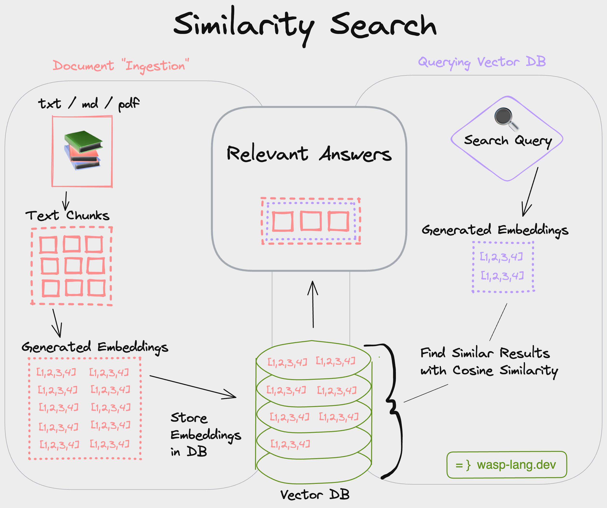

  

# What is it?
 Vector similarity search is powerful because it allows us to find results based on conceptual meaning rather than just shared keywords, e.g. searching "advantages of walking for health" in a keyword-based search would mainly focus on matching the keywords "advantages", "walking" and "health", whereas using vector similarity search would return articles which use other related terms such as "benefits", "active", "physical activity". 
 
 This is a [Wasp](https://wasp-lang.dev) template for generating embeddings and performing vector [similarity search](https://www.pinecone.io/learn/what-is-similarity-search/) for your own text data. Wasp is the quickest way to build severful fullstack apps. 
 
 This Wasp template uses:
 - React, Node/Express, and Prisma/PostgreSQL
 - OpenAI's [text-embedding-ada-002 model](https://platform.openai.com/docs/api-reference/embeddings/create) for embeddings generation
 - [Pinecone DB](https://pinecone.io) for storing and searching the vector embeddings
    

# How does it work?

1. Documents (e.g. docx, pdf, txt, md) are first parsed into text
2. Text is then split into "chunks" based on a specified chunk size, e.g. 300 tokens per chunk. Tokens are peices of a word, which the embedding algorithm uses to process text. More info [here](https://help.openai.com/en/articles/4936856-what-are-tokens-and-how-to-count-them)
3. Each chunk is then sent to the OpenAI API to generate an embedding. "An embedding is a vector (list) of floating point numbers. The distance between two vectors measures their relatedness. Small distances suggest high relatedness and large distances suggest low relatedness." - [OpenAI](https://platform.openai.com/docs/guides/embeddings/what-are-embeddings).
4. The embeddings are then stored in a vector database (Pinecone) and their IDs are stored in a Postgres database along with the original text chunk.
5. When a user searches for a query, the query is also first embedded. The embeddings are then compared against those in the Vector DB using cosine similarity (see `./src/server/searchEmbeddings`) to find the most similar embeddings to the query. The IDs of the most similar embeddings are then used to retrieve the original text chunks from the Postgres database and displayed to the user.
  

# How to get started?
1. Make sure you have the latest version of [Wasp](https://wasp-lang.dev) installed by running `curl -sSL https://get.wasp-lang.dev/installer.sh | sh` in your terminal.
2. Run `wasp new <project-name> -t embeddings` to create a new app using this template. 
3. Rename the `env.server.example` file to `.env.server` and fill in your API keys
4. Make sure you have a Database connected and running. Here are two quick options:  
  - run `wasp start db` once you have [Docker Deskop](https://www.docker.com/products/docker-desktop/) installed and running. This will start and connect to a Postgres database for you. No need to do anything else! 🤯 
  - or provision a Postgres database on [Railway](https://railway.app), go to settings and copy the `connection url`. Paste it as `DATABASE_URL=<your-postgres-connection-url>` into your `env.server` file.  
5. Run `wasp db migrate-dev` to initialize the database.
6. Run `wasp start`. This will install all dependencies and start the client and server for you :)
7. Go to `localhost:3000` in your browser (your NodeJS server will be running on port `3001`). The client will be running with a notice that no embeddings have been generated yet.
8. Run `wasp db seed` to generate embeddings from the text files within `src/shared/docs` (you can add your own files here) and seed the databases via the `generateEmbeddings` action. 
9. Run `wasp db studio` to see the data in your Postgres database. 
9. Install the Wasp extension for VSCode to get the best DX
10. Check the files for comments containing specific instructions