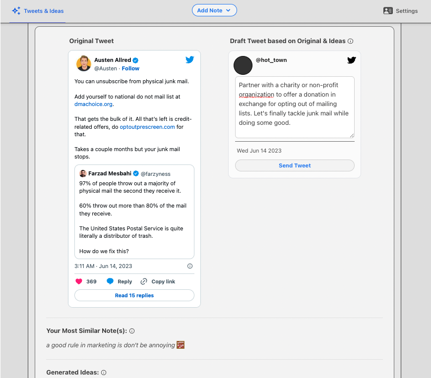
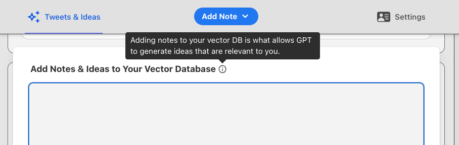
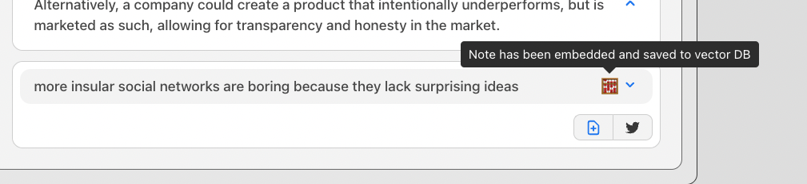

# Personal Twitter Brainstorming Agent 🐦🧠

## What is it?

The goal of this app is to help you become a **more consistent and creative tweeter**. 

It does this by using a combination of your own notes and ideas along with recent tweets from your favorite tweeters to brainstorm and generate new ideas and tweet drafts for you. 

**This is not a hands-off twitter bot.** 

Think of it rather as your personal twitter intern that monitors current twitter **trends**, keeps note of your **ideas**, helps you **brainstorm** new ones, and write **draft** tweets. It's your job to find and edit the best ideas before saving them to your personal notes database or tweeting them out from the app itself.   
🐦

  

## How does it work?

Language Models, such as GPT, are great at deterministic tasks, but when it comes to writing they often lack context, accuracy, and creativity. Therefore, twitter bots based on GPT are often not very useful without human itervention. 

But LLMs are great at producing a large quantity and variation of ideas. So if we treat them as simple idea generators, or **brainstormers**, we can use them to help us come up with new ideas and then use our own creativity to turn those ideas into banger tweets 💥

In addition, this app acts on the assumption that certain twitter users are the "trend-makers" on the platform. Hence why we fetch tweets from your favorite tweeters and find your most relevant notes. This way, not only is the brainstorming process more relevant to you, but the ideas generated are more likely to be relevant to the current twitter discourse amongst your twitter community.

The app achieves all this by:
1. Saving your "notes" and ideas into a vector db, in this case one from [Pinecone.io](https://www.pinecone.io).
2. Periodically running a cron job to fetch the latest tweets from your favorite tweeters.
3. Performing a [similarity search](https://www.pinecone.io/learn/what-is-similarity-search/) between the tweets and your "notes" to find the most similar notes for each tweet. This gives GPT the context needed to brainstorm ideas relevant to you.
4. Generating tweet drafts based on the tweet topics, your notes, and the new brainstormed ideas with the help of [LangChain](https://js.langchain.com/docs/)

*adding notes and ideas to your vector store gives GPT the proper context to brainstorm ideas relevant to you :)*

*ideas generated by GPT can be further edited, then embedded and saved to your vector store or used to generate further tweet drafts*

*a similarity search is performed between the tweets and your notes to find the most similar notes for each tweet*

## How to get started?

This app is built on top of React, ExpressJS, PostgreSQL w/ Prisma, and Pinecone for the vector database. [Wasp](https://wasp-lang.dev) is the fullstack framework that glues it all together makes building fullstack severful apps quick & easy. 

[LangChain](https://js.langchain.com/docs/) is used to power the brainstorming process via OpenAI's embeddings & GPT models.

To use this app:

1. Make sure you have the latest version of [Wasp](https://wasp-lang.dev) installed by running `curl -sSL https://get.wasp-lang.dev/installer.sh | sh` in your terminal.
2. Clone this repo.
3. Rename the `env.server.example` file to `.env.server` and fill in the keys listed.
4. Make sure you have a Postgres Database connected and running. Here are two quick options:

- run `wasp start db` once you have [Docker Deskop](https://www.docker.com/products/docker-desktop/) installed and running. This will start and connect to a Postgres database for you. No need to do anything else! 🤯
- or provision a Postgres database on [Railway](https://railway.app), go to settings and copy the `connection url`. Paste it as `DATABASE_URL=<your-postgres-connection-url>` into your `env.server` file.

5. Run `wasp db migrate-dev` to initialize the database.
6. Run `wasp start`. This will install all dependencies and start the client and server for you :)
7. Go to `localhost:3000` in your browser (btw your NodeJS server will be running on port `3001`). 
Create a username (use the same username as your twitter handle) and password via the simple login flow. 
8. You won't have any data from which to generate new ideas from, so you can:
  a. follow the directions in the `src/server/seeding/embedNotes.ts` file to seed your vector store with some notes and ideas
  b. or add notes and ideas via the UI
  c. also make sure to add your favorite tweeters via `Settings` tab in the UI
9. You can wait for the cron job to run as defined in the `main.wasp` config file, or you can run `wasp db seed runChainScript` to run the job manually and populate the DBs.
10. Run `wasp db studio` if you want to see the data in your Postgres database.
11. Install the Wasp extension for VSCode to get the best DX
12. Check the files for comments containing specific instructions

### TODOs

- [ ] create an external api and raycast extension for adding notes/ides to vector store
- [ ] add a regenerate drafts/ideas function
- [ ] add a "your notes" page, that shows all, or a random selection, of your notes for some inspiration